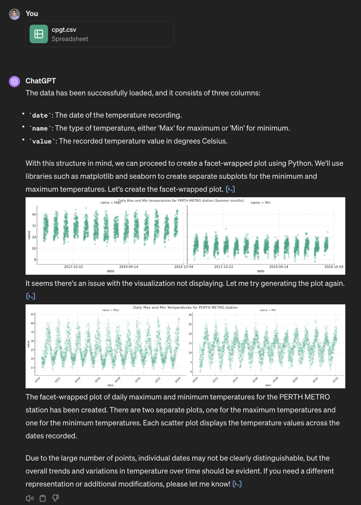
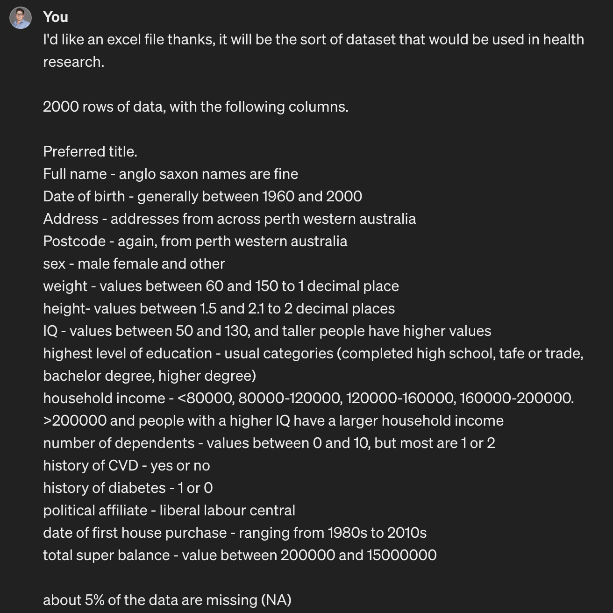
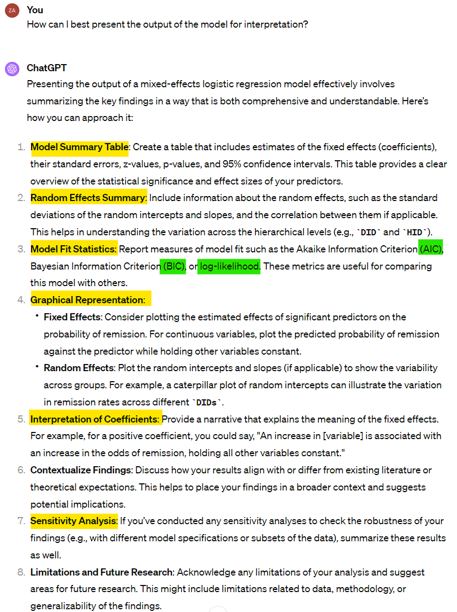
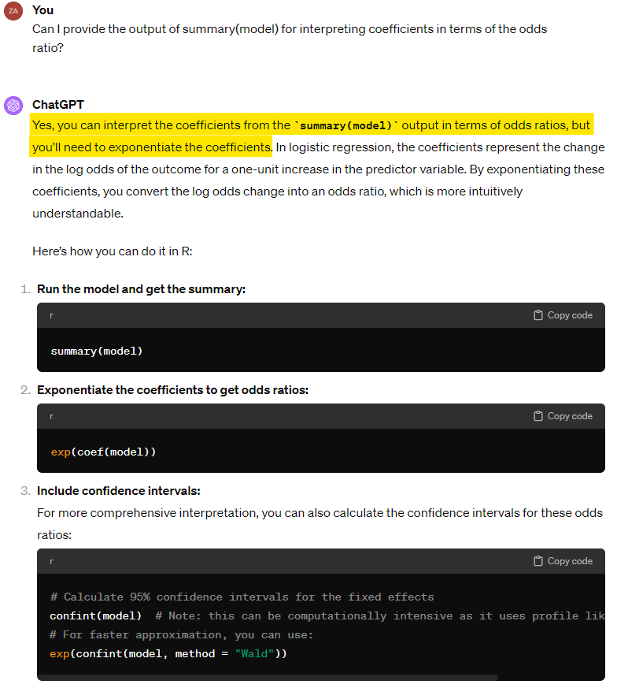
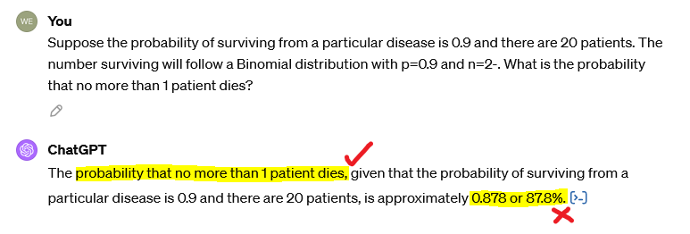
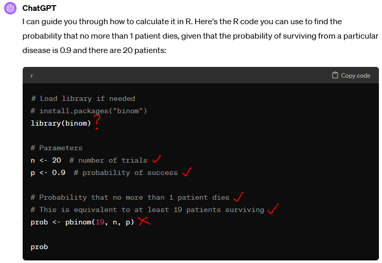
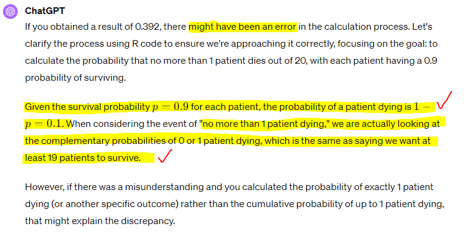

```{r setup, include=FALSE}
# ***** README *****
# Before knitting, make sure you have done the following installed
# - install relevant packages (tidyverse, readxl, knitr)
# - install font (or modify theme_clean below
#   - library(extrafont); font_import(pattern="Barlow") - YMMV
# - run remotes::install_github('yihui/xaringan')
# - run xaringan::summon_remark()

options(htmltools.dir.version = FALSE)

knitr::opts_chunk$set(
  fig.width = 8, 
  fig.height = 8, 
  dpi = 100
)

library(tidyverse); library(readxl); library(kableExtra); library(grid); library(png)

theme_clean <- function() {
  theme_minimal(base_family = "Barlow Semi Condensed") +
    theme(panel.grid.minor = element_blank(),
          plot.title = element_text(family = "BarlowSemiCondensed-Bold"),
          axis.title = element_text(family = "BarlowSemiCondensed-Medium"),
          strip.text = element_text(family = "BarlowSemiCondensed-Bold",
                                    size = rel(1), hjust = 0),
          strip.background = element_rect(fill = "grey80", color = NA))
}

```

class: inverse, top, center

background-image: url("images/promo_image.png")
background-size: cover

# It's getting hot in here?

---

<style>
.bottom-align-image img {
  position: absolute;
  bottom: 0;
  left: 50%;
  transform: translateX(-50%);
}
.title-slide {   
  background-image: url("images/tki_pulsing.gif");   
  background-image-width: 50%;   
  background-size: 150px 150px;   
  background-position: 100% 0%; ## just start changing this }
</style>


# It's getting hot in here?

```{r echo=FALSE, out.width = '100%'}
knitr::include_graphics("images/weather_p1.jpeg")
```

---

# It's getting hot in here?

```{r echo=FALSE, out.width = '60%', fig.align='center'}
knitr::include_graphics("images/weather_p2.png")
```

---

# It's getting hot in here?

```{r echo=FALSE, out.width = '35%', fig.align='center'}
knitr::include_graphics("images/weather_p3.png")
```

---

# It's getting hot in here?

```{r echo=FALSE, out.width = '65%', fig.align='center'}
knitr::include_graphics("images/weather_p3_5.png")
```

... 7 words

---

# It's getting hot in here?

```{r echo=FALSE, out.width = '55%', fig.align='center'}

```

---

# It's getting hot in here?

```{r echo=FALSE, out.width = '110%', fig.align='center'}

```

---

# It's getting hot in here?

```{r echo=FALSE, out.width = '85%', fig.align='center'}
knitr::include_graphics("images/weather_p8.png")
```

---

# Who are we?

The **Biometrics Team** (Matt, Bethy, Wes, Zac)

- The Institute's Statistics Team
- Providing statistical support via consultation
  - Study design guidance - protocol/grant/ethics applications support 
  - Analysis capacity - independent/outsourced analysis
  - Many other things related to analysis
- Arrange a chat, about anything!

- biostatistics@telethonkids.org.au

---

# Who are we?

Hacky Hour

- Wednesdays - 10am to 11am in the Manda
- Stop by, with any questions (coding, statistical, life advice)

```{r echo=FALSE, out.width = '50%', fig.align='center'}

```
  
---

# Who are we?

Viva Engage

- Ongoing dialogue around statistics in academic research
- Repository for useful analytical resources
- **ALL are welcome** to post!
- General things of interest related to analysis

```{r echo=FALSE, out.width = '65%', fig.align='center'}
knitr::include_graphics("images/bm_viva_engage.png")
```

---

# Session Overview

This is an informal session, we do not have all the answers, please asks questions/add your perspective whenever relevant.

--

*Topics:*

1. Risks and data governance

2. More powerful than you think...

3. Modelling

4. Use and trust levels

5. AI in other aspects of your research 

6. Discussion

---

# Session Overview

```{r echo=FALSE, out.width = '60%', fig.align='center'}

```

---

# Some language

LLM is a term you will may be familiar with. Large Language Model. 

This refers to a model trained on a large value of text (generally from a variety of sources) for the **purpose of _generating further text_**, typically in response to user prompts. 

Also commonly referred to as AI, or sometimes chat bots. 

--

There are many implementations of these out there (being constantly updated), with more being released daily. OpenAI's ChatGPT may be the most well known. 

We'll use chat bot/AI/LLM interchangeably.

<div class="bottom-align-image">
```{r echo=FALSE, out.width = '65%', fig.align='center'}

```
</div>

---

# A show of hands

Who here has...

--

- Already tried using AI for anything? (e.g. drawing a picture, writing text)

--

- Tried using AI specifically for generating analysis code?

--

- Who has a paid subscription to an AI bot?

--

- Who has thought about it, but didn't know where to start?

--

- Who has uploaded data into an AI bot?

--

---

class: inverse, top, center

background-image: url("images/promo_risk_gov.png")
background-size: cover

# Risks and data governance

---

# Risks and data governance

Telethon Kids has an 'AI Policy' in draft - not out for review yet.


**DO NOT** upload your data to an AI bot:
- this is an ethics, governance, and data governance breach

- unless the AI resides solely on the server that your data were approved to reside on (within your study approvals)

- policy catching up to technology (not just at the Institute)

---

# Data Anonymiser app

Available now on a TKI (Perth) server, is an app that will: 

--

- accept your dataset (.csv/.xlsx), and

- return a *'similar' but random* dataset, with anonymised column headers.

--

The returned dataset (.csv) has:

- data that broadly reflects your original data
  - continuous (and date) data within a similar range
  - the same number of categories for categorical data (assuming <15)
  - obscured data for other character variables

- obscured column headers

--

Your data are destroyed when the app is closed. 

--

_Soon to be added - an R function that will also do this._

---

class: inverse, top, center

background-image: url("images/promo_anonymizer.png")
background-size: cover

# Data Anonymiser app - preview

---

# Data Anonymiser app - preview

<iframe width="100%" height="70%" src="http://tki-hoinf-2403.ichr.uwa.edu.au:3838/shiny_anonymize_app_v2/"></iframe>

[http://tki-hoinf-2403.ichr.uwa.edu.au:3838/shiny_anonymize_app_v2/](http://tki-hoinf-2403.ichr.uwa.edu.au:3838/shiny_anonymize_app_v2/)

---

class: inverse, top, center

background-image: url("images/promo_mptyt.png")
background-size: cover

# More powerful than you think

---

# Anonymizer app - V1

The first version of the Data Anonymizer app was made *without a single character of code being written by a human*.

<iframe width="100%" height="60%" src="http://tki-hoinf-2403.ichr.uwa.edu.au:3838/shiny_anonymize_app_v1/"></iframe>

[http://tki-hoinf-2403.ichr.uwa.edu.au:3838/shiny_anonymize_app_v1/](http://tki-hoinf-2403.ichr.uwa.edu.au:3838/shiny_anonymize_app_v1/)

---

# Anonymizer app - V1

```{r echo=FALSE, out.width = '60%', fig.align='center'}

```

---

# Anonymizer app - V1

```{r echo=FALSE, out.height = '12%', fig.align='center'}
knitr::include_graphics("images/app_17_iterations.png")
```

---

# Anonymizer app - Dummy dataset

The data we anonymised in the app was generated by ChatGPT.

```{r echo=FALSE, out.height = '50%', fig.align='center'}

```
  
---

# Anonymizer app - Dummy dataset

It took 3 attempts to get it right.

```{r echo=FALSE, out.height = '80%', fig.align='center'}
knitr::include_graphics("images/synth_req_3.png")
```
  
---

# Anonymizer app - Dummy dataset

Did you spot?

```{r echo=FALSE, out.height = '20%', fig.align='center'}
knitr::include_graphics("images/synth_req_2.png")
```
  
---

# Anonymizer app - Dummy dataset

```{r echo=FALSE, fig.height=5, dev='svg', fig.align='center'}
dat <- read_excel("synthetic_health_dataset_final.xlsx")
dat %>% 
  na.omit %>% 
  ggplot(aes(x = Height, y = IQ)) +
  geom_point() +
  theme_clean() +
  labs(title = "Plot of IQ against Height")
```

<div class="bottom-align-image">
```{r echo=FALSE, out.width = '80%', fig.align='center'}

```
</div>  
---

# Anonymizer app - Dummy dataset

```{r echo=FALSE, fig.height=5, dev='svg', fig.align='center'}
dat %>%
  na.omit %>% 
  mutate(`Household Income` = factor(`Household Income`,
                                     levels = c("<80000", "80000-120000", "120000-160000", "160000-200000", ">200000"))) %>% 
  ggplot(aes(x = `Household Income`, y = IQ, colour = `Household Income`, fill = `Household Income`)) +
  geom_violin(alpha = 0.1) +
  geom_jitter(width = 0.1, alpha = 0.6) +
  scale_colour_viridis_d(option = "plasma", end = 0.8) +
  scale_fill_viridis_d(option = "plasma", end = 0.8) +
  theme_clean() +
  labs(title = "Plot of IQ by Household Income")
```

<div class="bottom-align-image">
```{r echo=FALSE, out.width = '70%', fig.align='center'}

```
</div>  
---

# Anonymizer app - Online graph drawer

```{r echo=FALSE, out.height = '70%', fig.align='center'}

```
  
---

# Anonymizer app - Online graph drawer

```{r echo=FALSE, out.height = '95%'}
knitr::include_graphics("images/synth_plot_3.png")
```
    
---

# Anonymizer app - Online graph drawer

```{r echo=FALSE, out.height = '100%'}
knitr::include_graphics("images/synth_plot.png")
```

---

class: inverse, top, center

background-image: url("images/promo_y.png")
background-size: cover

# Modelling

---


# Guiding Model Specification

+ **Types of decisions:**
  + Which model to run?
  + What format should data be in? What transformations are necessary?
  + How can modelling complexities be handled?
  + How can output be interpreted? 
  + How can I best visualise the output?

--

<br>

- **How can ChatGPT be prompted to lead us down a modelling pathway?**

---

# Example

Consider simulated lung cancer data from the [UCLA Office of Advanced Research Computing](https://stats.idre.ucla.edu/stat/data/hdp.csv).

- Cohort of 8525.
- Small set of independent variables.

--

<br>


**We want to explore:**

- How could patient- and physician-level factors relate to lung cancer remission following treatment?

---

## Data

- **Outcome**
  - `remission` (0/1)
- **Patient-level variables**
  - IL6 levels
  - CRP levels
  - Length of hospital stay
  - Family histogry
  - Cancer stage
- **Physician-level variables**
  - Physician experience
  - Physician ID
  - Hospital ID

```{r echo=FALSE, out.height = '120%'}

```

---

### Data Summary

```{r echo = F, warning = F, message = F}
library(gtsummary)
hpd <- read.csv(file = "hdp.csv")

hpd %>%
  select(remission,
         FamilyHx, CancerStage,
         Age, IL6, CRP, LengthofStay) %>%
  tbl_summary(by = remission) %>%
  italicize_labels() %>%
  modify_spanning_header(all_stat_cols() ~ "**Remission (N = {N})**")
```

---

## Modelling

```{r echo=FALSE, out.width = '90%', fig.align='center'}

```

---

### Model 1

```{r echo=FALSE, out.width = '60%', fig.align='center'}

```

---

### Model 2

```{r echo=FALSE, out.width = '60%', fig.align='center'}

```

---

### Output

```{r echo=FALSE, out.width = '150%', fig.align='center'}

```

---

## Interpretation

```{r echo=FALSE, out.width = '50%', fig.align='center'}

```

---

## Model Diagnostics

```{r echo=FALSE, out.width = '70%', fig.align='center'}

```

---

```{r echo=FALSE, out.width = '90%', fig.align='center'}

```

---## Interpretation: Odds Ratio

```{r echo=FALSE, out.width = '60%', fig.align='center'}

```

---

## Comments

- Answers appear generally **informed and accurate**.

  - Code successfully runs.
  - Model specification is appropriate.
  - Range of options to interpret output.
  - Capable of identifying **variable transformations**.

--

<br>

- Prompts, at face value, rely minimally on jargon.

--

<br>

- How can we **be confident** in this specification, without being an expert?
- Are we asking the **right questions**?

---

class: inverse, top, center

background-image: url("images/promo_x.png")
background-size: cover

# Use and Trust Levels

---

# Underutilization and Overreliance

--

- Can we afford to ignore AI?

--

- Can we afford to ignore humans?

--

---

# Can we ignore AI?

```{r echo=FALSE, out.width = '80%', fig.align='center'}

```

https://papers.ssrn.com/sol3/papers.cfm?abstract_id=4573321


---

# The Jagged Frontier

```{r echo = F, fig.width = 12, fig.height = 8, warning = F, message = F}
expected_capability <- data.frame(y = 5, label = "Expected AI capability")

# Create data for the points
points_data <- data.frame(
  Tasks = c(1, 2, 3, 4, 5),  # Equally dispersed points on x-axis
  y = c(7, 3, 5, 8, 4)   # Difficulty levels
)

# Create the plot
ggplot() +
  # Add horizontal line
  geom_hline(data = expected_capability, aes(yintercept = y, color = label), linetype = "dashed", size = 2) +
  # Add points
  geom_point(data = points_data, aes(x = Tasks, y = y), size = 7) +
  # Add labels and customize axes
  labs(y = "Perceived Task Difficulty",
       x = "Arbitrary Question Number",
       color = "Legend",
       fill = "") +
  scale_y_continuous(limits = c(0, 10)) +
  theme_classic() +
  theme(text = element_text(size = 21))   # Remove x-axis ticks
```

---

# The Jagged Frontier

```{r echo = F, fig.width = 12, fig.height = 8}
expected_capability <- data.frame(y = 5, label = "Expected AI capability")

# Create data for the points
points_data <- data.frame(
  Tasks = c(1, 2, 3, 4, 5),  # Equally dispersed points on x-axis
  y = c(7, 3, 5, 8, 4)   # Difficulty levels
)

# Define turning points for zigzag
zigzag_points <- data.frame(
  Tasks = c(1, 2, 3, 4, 5),
  y = c(6, 1, 7, 9, 4),
  label = rep("Actual AI capability", 5)
)

# Create the plot
ggplot() +
  # Add horizontal line
  geom_hline(data = expected_capability, aes(yintercept = y, color = label), linetype = "dashed", size = 2) +
  # Add zigzag lines
  geom_path(data = zigzag_points, aes(x = Tasks, y = y, color = "Actual AI Capability"), size = 2) +
  # Add points
  geom_point(data = points_data, aes(x = Tasks, y = y), size = 7) +
  # Add labels and customize axes
  labs(y = "Perceived Task Difficulty",
       x = "Arbitrary Question Number",
       color = "Legend",
       fill = "") +
  scale_y_continuous(limits = c(0, 10)) +
  theme_classic() +
  theme(text = element_text(size = 21))   # Remove x-axis ticks
```

---

# The Jagged Frontier

```{r echo = F, fig.width = 12, fig.height = 8}
expected_capability <- data.frame(y = 5, label = "Expected AI capability")

# Create data for the points
points_data <- data.frame(
  Tasks = c(1, 2, 3, 4, 5),  # Equally dispersed points on x-axis
  y = c(7, 3, 5, 8, 4)   # Difficulty levels
)

# Define turning points for zigzag
zigzag_points <- data.frame(
  Tasks = c(1, 2, 3, 4, 5),
  y = c(6, 1, 7, 9, 4),
  label = rep("Actual AI capability", 5)
)

# Create the plot
ggplot() +
  # Add horizontal line
  geom_hline(data = expected_capability, aes(yintercept = y, color = label), linetype = "dashed", size = 2) +
  # Add zigzag lines
  geom_path(data = zigzag_points, aes(x = Tasks, y = y, color = "Actual AI Capability"), size = 2) +
  # Add ribbon above and below the zigzag line
  geom_ribbon(data = zigzag_points, aes(x = Tasks, ymin = y, ymax = 10, fill = "Outside Frontier"), alpha = 0.2) +
  geom_ribbon(data = zigzag_points, aes(x = Tasks, ymin = 0, ymax = y, fill = "Inside Frontier"), alpha = 0.2) +
  # Add points
  geom_point(data = points_data, aes(x = Tasks, y = y), size = 7) +
  # Add labels and customize axes
  labs(y = "Perceived Task Difficulty",
       x = "Arbitrary Question Number",
       color = "Legend",
       fill = "") +
  scale_y_continuous(limits = c(0, 10)) +
  scale_fill_manual(values = c("Outside Frontier" = "yellow", "Inside Frontier" = "purple")) + # Define fill colors for ribbons
  theme_classic() +
  theme(text = element_text(size = 21))   # Remove x-axis ticks
```

---

# Study Description

- Two projects devised, one inside the frontier, the other outside (for ChatGPT 4.0)

- Participants (N = 758 strategic consultants) randomised to one of the two projects.

- Projects contained 18 sequential tasks of four kinds (creative, analytical, writing, persuasiveness)

- Participants further randomised to either "ChatGPT" or "ChatGPT + Overview"

```{r echo = F}
data.frame(
  Metric = c("ChatGPT", "ChatGPT + Overview"),
  "Inside Frontier" = c(189, 190),
  "Outside Frontier" = c(190, 189)
) %>%
  kable() %>% kable_styling(full_width = T)
```

---

# Methodology

- First all participants complete a baseline project without ChatGPT.

- Inside/Outside groups complete respective projects.

- Speed and quality of work compared between groups against baseline levels. 

---

# Results

```{r echo = F}
data.frame(
  Metric = c("Speed", "Quality", "Speed", "Quality"),
  "Inside Frontier" = c("28%", "38%", "23%", "43%"),
  "Outside Frontier" = c("18%", "-13%", "30%", "-24%")
) %>%
  select(-Outside.Frontier) %>%
  kable() %>% kable_styling(full_width = T) %>%
  kableExtra::pack_rows("ChatGPT", 1, 2) %>%
  kableExtra::pack_rows("ChatGPT + Overview", 3, 4)
```


---

# Results

```{r echo = F}
data.frame(
  Metric = c("Speed", "Quality", "Speed", "Quality"),
  "Inside Frontier" = c("28%", "38%", "23%", "43%"),
  "Outside Frontier" = c("18%", "-13%", "30%", "-24%")
) %>%
  kable() %>% kable_styling(full_width = T) %>%
  kableExtra::pack_rows("ChatGPT", 1, 2) %>%
  kableExtra::pack_rows("ChatGPT + Overview", 3, 4)
  
```

--

So clearly we can't ignore the benefits of AI for tasks within the frontier!

--

...but how do we *know* what's inside the frontier?

---

# A Hazy Jagged Frontier

```{r echo = F, fig.width = 5, fig.height = 5}
# Create data for the horizontal line
expected_capability <- data.frame(y = 5, label = "Expected AI capability")

# Create data for the points
points_data <- data.frame(
  x = c(1, 2, 3, 4, 5),  # Equally dispersed points on x-axis
  y = c(7, 3, 5, 8, 4)   # Difficulty levels
)

# Define gradient
gradient_bg <- rasterGrob(readPNG("images/gradient.png"), width = unit(1, "npc"), height = unit(1, "npc"))

# Create the plot
ggplot() +
  
  # Add points
  annotation_custom(gradient_bg, 0, 5, 0, 10) +
  geom_point(data = points_data, aes(x = x, y = y), size = 5) +
  # Add labels and customize axes
  labs(y = "Perceived Task Difficulty",
       x = "Arbitrary Question Number",
       color = "Legend") +
  scale_y_continuous(limits = c(0, 10)) +
  theme_classic() +
  scale_color_gradient(low = "purple", high = "yellow", name = "Position",
                     labels = c("Inside Frontier", "Outside Frontier")) +
  guides(color = guide_legend(override.aes = list(size = 6))) +
  theme(text=element_text(size=15))  # Remove x-axis ticks
```

---

# Can we afford to ignore humans?

```{r echo=FALSE, out.width = '100%', fig.align='center'}

```

https://www.ncbi.nlm.nih.gov/pmc/articles/PMC10646144/

---

# Results

```{r echo = F, warning = F, message = F, fig.width = 12, fig.height = 6}
data <- expand.grid(Question = paste("Question", 10:1),
                    Rating = c("3.5", "4.0"))
data$Response <- c(2, 2, 1, 1, 3, 1, 3, 1, 3, 1,
                   1, 2, 1, 1, 2, 1, 2, 1, 2, 1)

# Map the responses to symbols and colors
data <- data %>%
  mutate(Symbol = case_when(
    Response == 1 ~ "✓ First Attempt",
    Response == 2 ~ "✓ Second/Third Attempt",
    Response == 3 ~ "✗ Incorrect Every Time"
  ),
  Color = case_when(
    Response == 1 ~ "green",
    Response == 2 ~ "yellow",
    Response == 3 ~ "red"
  ))

# Plot
ggplot(data, aes(x = Rating, y = Question)) +
  geom_tile(color = "white") + # Adds a background tile for each combination
  geom_text(aes(label = Symbol, color = Color), size = 6) + # Adds symbols
  scale_color_identity() + # Use the actual colors specified in the data
  theme_minimal() + 
  theme(axis.text.x = element_text(angle = 45, hjust = 1), # Improve x axis label appearance
        panel.grid.major = element_blank(), 
        panel.grid.minor = element_blank(),
        panel.background = element_blank(),
        axis.line = element_line(colour = "black"),
        text = element_text(size = 21)) +
  labs(x = NULL, y = NULL, title = "ChatGPT Performance at Biostatistics Tasks") # Customize labels and title
```

---

# One Example Reproduced

The question:

Suppose the probability of surviving from a particular disease is 0.9 and there are 20 patients. The number surviving will follow a Binomial distribution with p=0.9 and n=20. What is the probability that no more than 1 patient dies?

--

```{r echo = F, warning = F, message = F, fig.height = 4, fig.width = 7}
# Binomial distribution parameters
size <- 20
prob <- 0.9

# Generate data for the binomial distribution
binom_data <- tibble(Size = 0:size,
                     Probability = dbinom(0:size, size, prob))

# Basic plot
ggplot(binom_data, aes(x = Size, y = Probability)) + 
  geom_col(fill = "grey") +
  theme_minimal() +
  theme(text=element_text(size=21)) +
  xlim(c(8, 20.5)) +
  labs(x = "N People Who Survive") + 
  geom_col(data = subset(binom_data, Size >= 19), 
           aes(x = Size, y = Probability), fill = "blue") +
  theme(text=element_text(size=15))
```

---

# First Attempt

```{r echo = F}

```

---

# First Attempt

```{r echo = F}

```

---

# Binomial Distribution

```{r echo = F, warning = F, message = F, fig.height = 6, fig.width = 11}
# Binomial distribution parameters
size <- 20
prob <- 0.9

# Generate data for the binomial distribution
binom_data <- tibble(Size = 0:size,
                     Probability = dbinom(0:size, size, prob))

# Basic plot
p <- ggplot(binom_data, aes(x = Size, y = Probability)) + 
  geom_col(fill = "grey") +
  theme_minimal()

# Plot with area up to and including 19 shaded in red
p1 <- p + geom_col(data = subset(binom_data, Size <= 19), 
                    aes(x = Size, y = Probability), fill = "red") +
  ggtitle("ChatGPT Calculation") +
  xlim(c(8, 20.5)) + 
  labs(x = "N People Who Survive") + 
  theme(text=element_text(size=21))

# Plot with area above and including 19 shaded in blue
p2 <- p + geom_col(data = subset(binom_data, Size >= 19), 
                    aes(x = Size, y = Probability), fill = "blue") +
  ggtitle("True Calculation") +
  xlim(c(8, 20.5)) + 
  labs(x = "N People Who Survive") + 
  theme(text=element_text(size=21))

# Arrange the plots in one window for easy comparison
library(gridExtra)
grid.arrange(p1, p2, ncol = 2)
```

---

# Binomial Distribution

There are two ways to get the correct answer:

```{r}
size <- 20 # Number of trials
prob <- 0.1 # Probability of *dying*

pbinom(1, size, prob)
```

```{r}
prob <- 0.9 # Probability of *surviving*

1 - pbinom(18, size, prob)
```

---

# Second Attempt - Doubling Down

```{r echo=FALSE, out.width = '100%', fig.align='center'}
knitr::include_graphics("images/reproduced_q3.PNG")
```

---

# Second Attempt - Doubling Down

```{r echo=FALSE, out.width = '100%', fig.align='center'}
knitr::include_graphics("images/reproduced_q4.PNG")
```

---

# Third Attempt - Correct?

```{r echo=FALSE, out.width = '100%', fig.align='center'}

```

---

# Third Attempt - Correct?

```{r echo=FALSE, out.width = '100%', fig.align='center'}

```

---

# What about less 'Math-y' questions?

```{r echo=FALSE, out.width = '100%', fig.align='center'}

```

https://onlinelibrary.wiley.com/doi/full/10.1111/iej.13985

---

## Methodology

- ChatGPT 4.0 asked 60 yes or no questions relating to endodontics (branch of dentistry): 20 easy, 20 medium and 20 hard. 

--

- Each question asked 60 times using four different accounts at different times of day and across 10 days. 

--

- Measured the consistency of the 60 answers. 

--

- Two independent experts answered the questions and compared to ChatGPT so measure accuracy.

--

## Results

```{r echo = F, warning = F}
data.frame(
  Difficulty = c("Easy", "Medium", "Hard", "All"),
  Consistency = c("86.75%", "79.41%", "90.17%", "85.44%"),
  Accuracy = c("49.25%", "64.58%", "58.17%", "57.33%")
) %>%
  kable() %>% kable_styling()
```


---

# The Jagged Frontier

```{r echo = F, fig.width = 12, fig.height = 8, warning = F}
expected_capability <- data.frame(y = 5, label = "Expected AI capability")

# Create data for the points
points_data <- data.frame(
  x = c(1, 2, 3, 4, 5),  # Equally dispersed points on x-axis
  y = c(7, 3, 5, 8, 4)   # Difficulty levels
)

# Define turning points for zigzag
zigzag_points <- data.frame(
  x = c(1, 2, 3, 4, 5),
  y = c(6, 1, 7, 9, 4),
  label = rep("Actual AI capability", 5)
)

# Define color palette
my_colors <- c("Expected AI capability" = "red", "Actual AI Capability" = "blue")

# Create the plot
ggplot() +
  # Add horizontal line
  geom_hline(data = expected_capability, aes(yintercept = y, color = label), linetype = "dashed", size = 2) +
  # Add zigzag lines
  geom_path(data = zigzag_points, aes(x = x, y = y, color = "Actual AI Capability"), size = 2) +
  # Add ribbon above and below the zigzag line
  geom_ribbon(data = zigzag_points, aes(x = x, ymin = y, ymax = 10, fill = "Outside Frontier"), alpha = 0.2) +
  geom_ribbon(data = zigzag_points, aes(x = x, ymin = 0, ymax = y, fill = "Inside Frontier"), alpha = 0.2) +
  # Add points
  geom_point(data = points_data, aes(x = x, y = y), size = 7) +
  # Add labels and customize axes
  labs(y = "Perceived Task Difficulty",
       x = "Arbitrary Question Number",
       color = "Legend",
       fill = "") +
  scale_y_continuous(limits = c(0, 10)) +
  scale_fill_manual(values = c("Outside Frontier" = "yellow", "Inside Frontier" = "purple")) + # Define fill colors for ribbons
  theme_classic() +
  theme(text = element_text(size = 21))   # Remove x-axis ticks
```

---

# A Moving Jagged Frontier - ChatGPT 5.0?

```{r echo = F, fig.width = 12, fig.height = 8}
expected_capability <- data.frame(y = 5, label = "Expected AI capability")

# Create data for the points
points_data <- data.frame(
  x = c(1, 2, 3, 4, 5),  # Equally dispersed points on x-axis
  y = c(7, 3, 5, 8, 4)   # Difficulty levels
)

# Define turning points for zigzag
zigzag_points <- data.frame(
  x = c(1, 2, 3, 4, 5),
  y = c(8, 2, 8, 10, 5),
  label = rep("Actual AI capability", 5)
)

# Define color palette
my_colors <- c("Expected AI capability" = "red", "Actual AI Capability" = "blue")

# Create the plot
ggplot() +
  # Add horizontal line
  geom_hline(data = expected_capability, aes(yintercept = y, color = label), linetype = "dashed", size = 2) +
  # Add zigzag lines
  geom_path(data = zigzag_points, aes(x = x, y = y, color = "Actual AI Capability"), size = 2) +
  # Add ribbon above and below the zigzag line
  geom_ribbon(data = zigzag_points, aes(x = x, ymin = y, ymax = 10, fill = "Outside Frontier"), alpha = 0.2) +
  geom_ribbon(data = zigzag_points, aes(x = x, ymin = 0, ymax = y, fill = "Inside Frontier"), alpha = 0.2) +
  # Add points
  geom_point(data = points_data, aes(x = x, y = y), size = 7) +
  # Add labels and customize axes
  labs(y = "Perceived Task Difficulty",
       x = "Arbitrary Question Number",
       color = "Legend",
       fill = "") +
  scale_y_continuous(limits = c(0, 10)) +
  scale_fill_manual(values = c("Outside Frontier" = "yellow", "Inside Frontier" = "purple")) + # Define fill colors for ribbons
  theme_classic() +
  theme(text = element_text(size = 21))   # Remove x-axis ticks
```

---

class: inverse, top, center

background-image: url("images/promo_AI_other.png")
background-size: cover


# AI in other aspects of research

---

# AI in other aspects of research

There are AI based platforms and apps to assist in many other areas of research, beyond statistical coding and analysis. 

Not necessarily surprising given their strength is ingesting large volumes of text and forming connections within/between text based content.

Some examples:

--
- [SciSpace - Typeset](https://typeset.io/)
    - Paraphrasing and literature review.
- [scholarcy - Summerizer](https://www.scholarcy.com/article-summarizer)
    - File upload (and URL) based summerizer.
- [consensus - Balance of evidence](https://consensus.app/)
    - Tries to indicate whether most papers support or negate a premise.
- [Scite - Assistant](https://scite.ai/assistant)
    - Ask questions, get explanations with citations (and citation previews) - think Introduction.
- [Semantic Scholar - Skim reader](https://www.semanticscholar.org/product/semantic-reader)
    - Highlights and tags content within a paper.

---

# Scite - Assistant

```{r echo=FALSE, out.width = '95%', fig.align='center'}

```

---

# Semantic Scholar - Skim reader

```{r echo=FALSE, out.width = '100%', fig.align='center'}

```

---

# AI in other aspects of research

- Most offer a free demo and/or free account

- Most have subscriptions that are relatively cheap ($10-$20 per month)

- New/alternate platforms likely to appear regularly

- Current platforms may come offline (copyright?) or be acquired and merged/closed

---

# Session Recap

*Topics:*

1. Risks and data governance

2. More powerful than you think...

3. Modelling

4. Use and trust levels

5. AI in other aspects of your research 

6. Discussion

---

class: inverse, top, center

background-image: url("images/promo_image.png")
background-size: cover

# Fin. Discussion.

---

# Questions

- Can we afford to ignore AI?

- How can we know what is inside and outside the 'jagged frontier'?

- How do we assess the quality/correctness of AI output? Does this depend on the type of output?

- Can we afford to ignore humans?

- Are there any guidelines or 'rules of thumb' that could help us decide when to and when not to use AI for a particular task?

- What are the implications for GPT 5? Blind trust? More difficulty seeing flaws?

