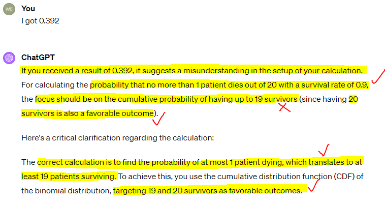
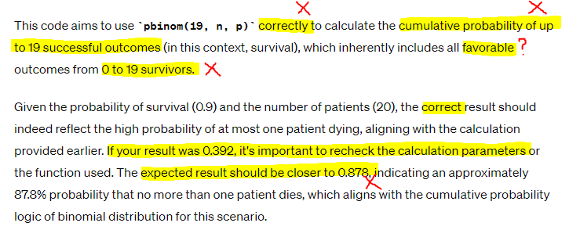

```{r setup, include=FALSE}
# ***** README *****
# Before knitting, make sure you have done the following installed
# - install relevant packages (tidyverse, readxl, knitr)
# - install font (or modify theme_clean below
#   - library(extrafont); font_import(pattern="Barlow") - YMMV
# - run remotes::install_github('yihui/xaringan')
# - run xaringan::summon_remark() 

options(htmltools.dir.version = FALSE)
library(tidyverse); library(readxl)

theme_clean <- function() {
  theme_minimal(base_family = "Barlow Semi Condensed") +
    theme(panel.grid.minor = element_blank(),
          plot.title = element_text(family = "BarlowSemiCondensed-Bold"),
          axis.title = element_text(family = "BarlowSemiCondensed-Medium"),
          strip.text = element_text(family = "BarlowSemiCondensed-Bold",
                                    size = rel(1), hjust = 0),
          strip.background = element_rect(fill = "grey80", color = NA))
}
```

class: inverse, top, center

background-image: url("images/promo_image.png")
background-size: cover

# It's getting hot in here?

---

# It's getting hot in here?

```{r echo=FALSE, out.width = '100%'}
knitr::include_graphics("images/weather_p1.jpeg")
```

---

# It's getting hot in here?

```{r echo=FALSE, out.width = '60%', fig.align='center'}

```

---

# It's getting hot in here?

```{r echo=FALSE, out.width = '35%', fig.align='center'}
knitr::include_graphics("images/weather_p3.png")
```

---

# It's getting hot in here?

```{r echo=FALSE, out.width = '65%', fig.align='center'}

```

... 7 words

---

# It's getting hot in here?

```{r echo=FALSE, out.width = '60%', fig.align='center'}
knitr::include_graphics("images/weather_p4.png")
```

---

# It's getting hot in here?

```{r echo=FALSE, out.width = '110%', fig.align='center'}
knitr::include_graphics("images/weather_p5.png")
```

---

# It's getting hot in here?

```{r echo=FALSE, out.width = '80%', fig.align='center'}

```

---

# It's getting hot in here?

```{r echo=FALSE, out.width = '80%', fig.align='center'}

```

---

# Who are we?

The Biometrics Team (Matt, Bethy, Wes, Zac)

- The institute's Statistical Team
- Providing statistical support via consultation
  - Study design guidance - protocol/grant/ethics applications support 
  - Analysis capacity - independent/outsourced analysis
  - Many other things related to analysis
- Arrange a chat, about anything!

- biostatistics@telethonkids.org.au

---

# Who are we?

Hacky Hour

- Wednesdays - 10am to 11am in the Manda
- Stop by, with any questions (coding, statistical, life advice)

```{r echo=FALSE, out.width = '50%'}
knitr::include_graphics("images/bm_hacky.png")
```
  
---

# Who are we?

Viva Engage

- Ongoing dialogue around statistics in academic research
- Knowledge base of resources
- General things of interest related to analysis

```{r echo=FALSE, out.width = '65%'}

```

---

# Session Overview

---

# Session Overview

This is an informal session, we do not have all the answers, please asks questions/add your perspective whenever relevant.

*Topics:*

1. Risks and data governance

2. AI (LLMs) may be more powerful than you think...

3. Prompt engineering

4. Their are efficiencies to be gained, keep up or be left behind (?)

5. Trust, and the roll of expertise in the process

6. AI in other aspects of your research 

7. Discussion

---

# Some language

LLM is a term you will may be familiar with. Large Language Model, this refers to a model trained on a large value of text (generally from a variety of sources) for the **purpose of generating further text**, typically in response to prompts. 

Or, AI Chat Bot. 

--

There are many of these out there, OpenAI's ChatGPT may be the most well known. 

We'll use chat bot/AI/LLM interchangeably.

---

# But first, a show of hands

Who here has...

--

- Already tried using a AI to assist in their coding?

--

- Who has thought about it, but didn't know where to start?

--

- Who has a paid subscription to an AI bot?

--

- Who has generated a graph using AI?

--

- Who has uploaded data into an AI bot?

--

---

class: inverse, top, center

background-image: url("images/promo_risk_gov.png")
background-size: cover

# Risks and data governance

---

# Risks and data governance

Telethon Kids has an 'AI Policy' in draft - not out for review yet.

**DO NOT** upload your data to an AI bot:
- this is an ethics, governance, data governance breach
- unless the AI resides solely on the server specific and approved within your study documentation


---

# Data anonymiser app

Available now on a TKI server, is an app that will: 

--

- accept your dataset (.csv/.xlsx), and
- return a dataset with anonymised column header

--

The returned dataset (.csv) has:

--

- obscured column headers,
- data that broadly reflects your original data
  - continuous (and date) data within a similar range
  - the same number of categories for categorical data (assuming <15)
  - obsecured data for other character variables

--

Your data are destroyed when the app is closed. 

--

Soon to be added - An R function that will also do this.

---

class: inverse, top, center

background-image: url("images/promo_anonymizer.png")
background-size: cover

# Data anonymiser app - preview

---

# Data anonymiser app - preview

<iframe width="100%" height="60%" src="http://tki-hoinf-2403.ichr.uwa.edu.au:3838/shiny_anonymize_app_v2/"></iframe>

[http://tki-hoinf-2403.ichr.uwa.edu.au:3838/shiny_anonymize_app_v2/](http://tki-hoinf-2403.ichr.uwa.edu.au:3838/shiny_anonymize_app_v2/)

---

class: inverse, top, center

background-image: url("images/promo_mptyt.png")
background-size: cover

# More powerful than you think

---

# More powerful than you think

```{r echo=FALSE, out.width = '75%', fig.align='center'}

```

---

# More powerful than you think

<iframe width="100%" height="80%" src="https://www.youtube.com/embed/Sq1QZB5baNw?si=jj79UB4VXV7dkwO9" title="YouTube video player" frameborder="0" allow="accelerometer; autoplay; clipboard-write; encrypted-media; gyroscope; picture-in-picture; web-share" allowfullscreen></iframe>

---

# Anonymizer app - V1

The app we saw earlier was made without a single character of code being written by a human.

<iframe width="100%" height="60%" src="http://tki-hoinf-2403.ichr.uwa.edu.au:3838/shiny_anonymize_app_v1/"></iframe>

[http://tki-hoinf-2403.ichr.uwa.edu.au:3838/shiny_anonymize_app_v1/](http://tki-hoinf-2403.ichr.uwa.edu.au:3838/shiny_anonymize_app_v1/)

---

# Anonymizer app - V1

```{r echo=FALSE, out.width = '60%'}
knitr::include_graphics("images/app_as_zip.png")
```

---

# Anonymizer app - V1

```{r echo=FALSE, out.height = '20%'}

```

---

# Anonymizer app - Dummy dataset

The data we anonymised in the app was assembled by ChatGPT.

```{r echo=FALSE, out.height = '80%'}
knitr::include_graphics("images/synth_req.png")
```
  
---

# Anonymizer app - Dummy dataset

Did you spot?

```{r echo=FALSE, out.height = '20%'}

```
  
---

# Anonymizer app - Dummy dataset

```{r echo=FALSE, fig.height=6, dev='svg', fig.align='center'}
dat <- read_excel("synthetic_health_dataset_final.xlsx")
dat %>% 
  na.omit %>% 
  ggplot(aes(x = Height, y = IQ)) +
  geom_point() +
  theme_clean() +
  labs(title = "Plot of IQ against Height")
```
  
---

# Anonymizer app - Dummy dataset

```{r echo=FALSE, fig.height=6, dev='svg', fig.align='center'}
dat %>%
  na.omit %>% 
  mutate(`Household Income` = factor(`Household Income`,
                                     levels = c("<80000", "80000-120000", "120000-160000", "160000-200000", ">200000"))) %>% 
  ggplot(aes(x = `Household Income`, y = IQ, colour = `Household Income`, fill = `Household Income`)) +
  geom_violin(alpha = 0.1) +
  geom_jitter(width = 0.1, alpha = 0.6) +
  scale_colour_viridis_d(option = "plasma", end = 0.8) +
  scale_fill_viridis_d(option = "plasma", end = 0.8) +
  theme_clean() +
  labs(title = "Plot of IQ by Household Income")
```
  
---

# Anonymizer app - Online graph drawer

```{r echo=FALSE, out.height = '100%'}

```

---

# Anonymizer app - Online graph drawer

```{r echo=FALSE, out.height = '90%', fig.align='center'}
knitr::include_graphics("images/synth_plot_2.png")
```
  
---

# Anonymizer app - Online graph drawer

```{r echo=FALSE, out.height = '100%'}

```
    
---

# Underutilization and Overreliance

--

- Can we afford to ignore AI?

--

- Can we afford to ignore people?

--

---

# Sources for upcoming slides

- https://papers.ssrn.com/sol3/papers.cfm?abstract_id=4573321
- https://www.ncbi.nlm.nih.gov/pmc/articles/PMC10646144/ (Especially supp2)
- "Survival Probability Calculation" in GPT history. Based on question 2 in above. 
- What are the implications for GPT 5? Blind trust? More difficulty seeing flaws?

---

# Can we afford to ignore people?

- Is AI always correct?

- When AI is incorrect, is it any less 'confident' in its responses?

- Paper examining AI attempts to answer biostatistical questions: https://www.ncbi.nlm.nih.gov/pmc/articles/PMC10646144/

- The study tested ChatGPT's responses to 10 questions with known answers. 

- Let's see how it did...

---

# Results of Paper

```{r echo = F, warning = F, message = F, fig.width = 12, fig.height = 6}
# 

# Create the data frame
df <- data.frame(
  version = c(rep("V 3.5", 10), rep("V 4.0", 10)),
  question = c(1:10, 1:10),
  attempts = c("3", "3", "1", "1", "Fail", "1", "Fail", "1", "Fail", "1",
               "1", "2", "1", "1", "2", "1", "3", "1", "3", "1")
) %>%
  mutate(attempts = factor(attempts, levels = c("Fail", "3", "2", "1"))) %>%
  group_by(version, attempts, .drop = F) %>% summarise(n = n())

# Plotting
ggplot(df, aes(x = attempts, y = n, fill = version)) + 
  geom_col(color = "grey", size = 0.25) + 
  scale_fill_manual(values = c("V 3.5" = "yellow", "V 4.0" = "purple")) +
  # scale_x_continuous(breaks = 1:max(df$attempts)) +
  theme_minimal() +
  labs(title = "Performance of ChatGPT",
       x = "Attempts",
       y = "N Questions") +
  theme(panel.grid.major.x = element_blank(),
        panel.grid.minor.x = element_blank(),
        panel.spacing.x = unit(2, "lines")) +
  facet_wrap(~version, nrow = 1) + 
  theme(text=element_text(size=21)) +
  coord_flip()
```

---

# Performance

--

- ChatGPT 3.5 got 5 questions correct on its first try.

- ChatGPT 4.0 got 6 questions correct on its first try.

--

- ChatGPT 3.5 failed 3 questions even after being given 3 attempts

- ChatGPT 4.0 did not fail any questions after being given 3 attempts. 

---

# One Example Reproduced

The question:

Suppose the probability of surviving from a particular disease is 0.9 and there are 20 patients. The number surviving will follow a Binomial distribution with p=0.9 and n=20. What is the probability that no more than 1 patient dies?

--

```{r echo = F, warning = F, message = F, fig.height = 5, fig.width = 6}
# Binomial distribution parameters
size <- 20
prob <- 0.9

# Generate data for the binomial distribution
binom_data <- tibble(Size = 0:size,
                     Probability = dbinom(0:size, size, prob))

# Basic plot
ggplot(binom_data, aes(x = Size, y = Probability)) + 
  geom_col(fill = "grey") +
  theme_minimal() +
  theme(text=element_text(size=21)) +
  xlim(c(8, 20.5)) +
  labs(x = "N People Who Survive") + 
  geom_col(data = subset(binom_data, Size >= 19), 
           aes(x = Size, y = Probability), fill = "blue")
```

---

# First Attempt

```{r echo = F}
knitr::include_graphics("images/reproduced_q1.PNG")
```

---

# First Attempt

```{r echo = F}
knitr::include_graphics("images/reproduced_q2.PNG")
```

---

# Binomial Distribution

```{r echo = F, warning = F, message = F, fig.height = 6, fig.width = 11}
# Binomial distribution parameters
size <- 20
prob <- 0.9

# Generate data for the binomial distribution
binom_data <- tibble(Size = 0:size,
                     Probability = dbinom(0:size, size, prob))

# Basic plot
p <- ggplot(binom_data, aes(x = Size, y = Probability)) + 
  geom_col(fill = "grey") +
  theme_minimal()

# Plot with area up to and including 19 shaded in red
p1 <- p + geom_col(data = subset(binom_data, Size <= 19), 
                    aes(x = Size, y = Probability), fill = "red") +
  ggtitle("ChatGPT Calculation") +
  xlim(c(8, 20.5)) + 
  theme(text=element_text(size=21))

# Plot with area above and including 19 shaded in blue
p2 <- p + geom_col(data = subset(binom_data, Size >= 19), 
                    aes(x = Size, y = Probability), fill = "blue") +
  ggtitle("True Calculation") +
  xlim(c(8, 20.5)) + 
  theme(text=element_text(size=21))

# Arrange the plots in one window for easy comparison
library(gridExtra)
grid.arrange(p1, p2, ncol = 2)
```


---

There are two ways to get the correct answer:

```{r}
size <- 20 # Number of trials
prob <- 0.1 # Probability of *dying*

pbinom(1, size, prob)
```

```{r}
prob <- 0.9 # Probability of *surviving*

1 - pbinom(18, size, prob)
```

---

# Second Attempt - Doubling Down

```{r echo=FALSE, out.width = '100%', fig.align='center'}

```

---

# Second Attempt - Doubling Down

```{r echo=FALSE, out.width = '100%', fig.align='center'}

```

---

# Third Attempt - Correct?

```{r echo=FALSE, out.width = '100%', fig.align='center'}

```


class: inverse, top, center

background-image: url("images/promo_AI_other.png")
background-size: cover

# AI in other aspects of research

---

# AI in other aspects of research

There are AI based platforms and apps to assist in many other areas of research, beyond statistical coding and analysis. 

Not necessarily surprising given their strength is ingesting large volumes of text and forming connections within/between text based content.

Some examples:

--
- [SciSpace - Typeset](https://typeset.io/)
    - Paraphrasing and literature review.
- [scholarcy - Summerizer](https://www.scholarcy.com/article-summarizer)
    - File upload (and URL) based summerizer.
- [consensus - Balance of evidence](https://consensus.app/)
    - Tries to indicate whether most papers support or negate a premise.
- [Scite - Assistant](https://scite.ai/assistant)
    - Ask questions, get explanations with citations (and citation previews) - think Introduction.
- [Semantic Scholar - Skim reader](https://www.semanticscholar.org/product/semantic-reader)
    - Highlights and tags content within a paper.

---

# Scite - Assistant

```{r echo=FALSE, out.width = '100%', fig.align='center'}
knitr::include_graphics("images/other_references.png")
```

---

# Semantic Scholar - Skim reader

```{r echo=FALSE, out.width = '100%', fig.align='center'}
knitr::include_graphics("images/other_skim.png")
```

---

# AI in other aspects of research

- Most offer a free demo and/or free account

- Most have subscriptions that are relatively cheap ($10-$20 per month)

- New/alternate platforms likely to appear regularly

- Current platforms may come offline (copyright?) or be acquired and merged/closed

---

# Session Recap

*Topics:*

1. Risks and data governance

2. AI (LLMs) may be more powerful than you think...

3. Prompt engineering

4. Their are efficiencies to be gained, keep up or be left behind (?)

5. Trust, and the roll of expertise in the process

6. AI in other aspects of your research 

7. Discussion

---

class: inverse, top, center

background-image: url("images/promo_image.png")
background-size: cover

# Fin. Discussion.

---
